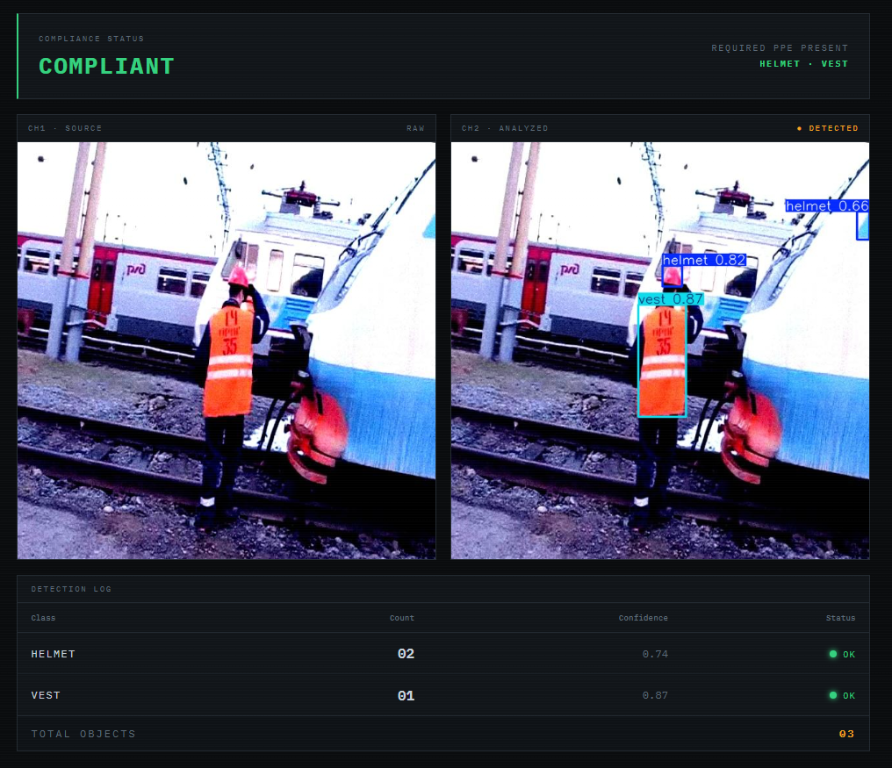
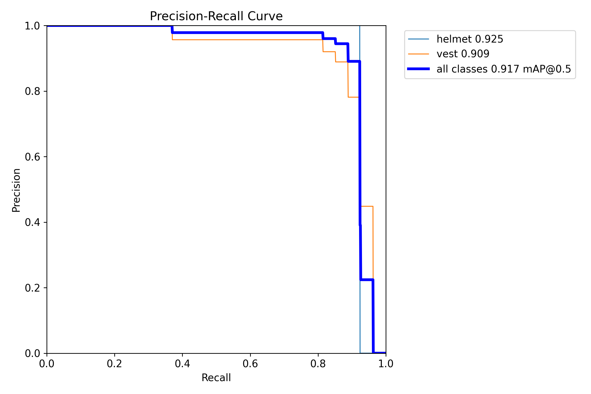
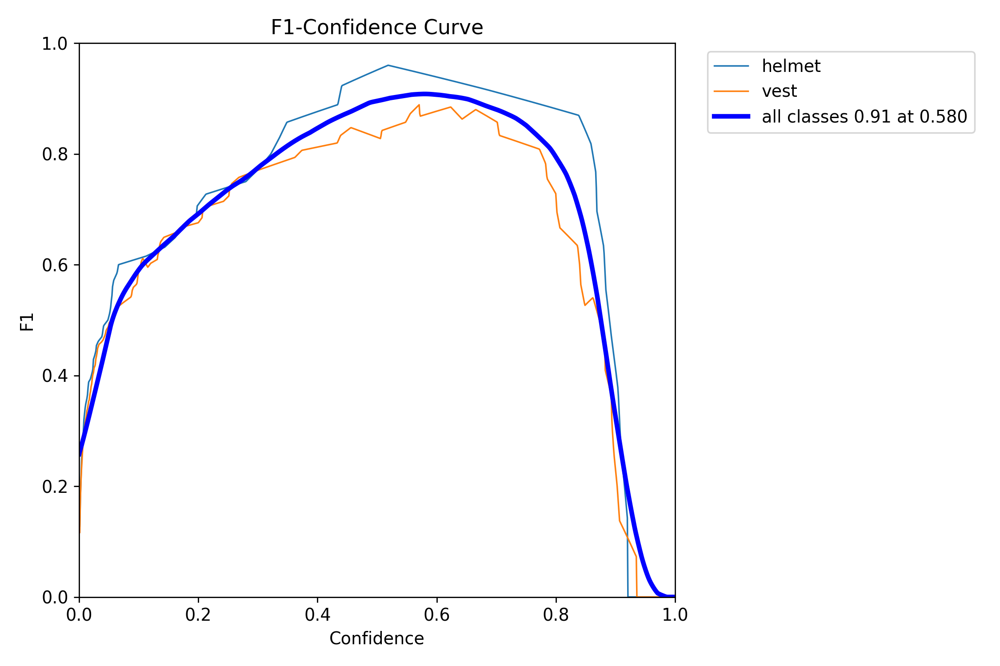
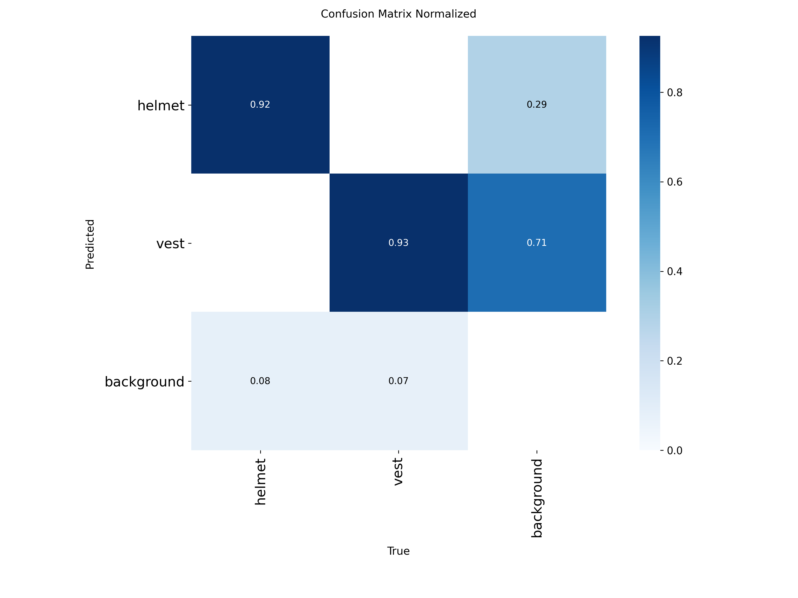
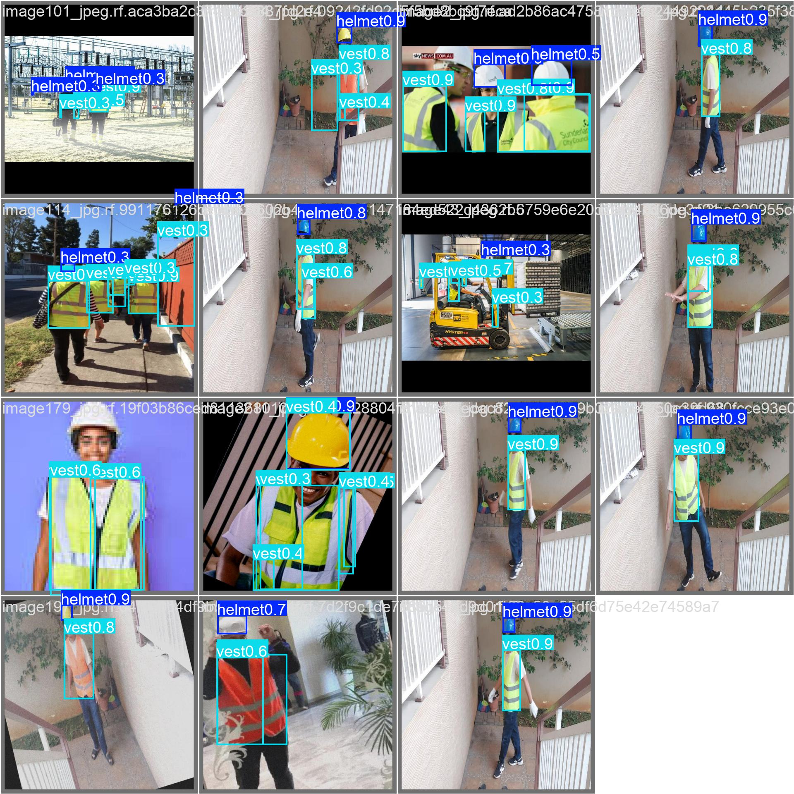

# PPE Detection — Construction Safety Vision

Deteksi **Alat Pelindung Diri** (Personal Protective Equipment) pada citra lokasi
kerja konstruksi menggunakan **YOLO11** + **Flask**. Sistem memeriksa kelengkapan
*helmet* dan *vest*, lalu menerbitkan **status kepatuhan** beserta tingkat
keyakinan deteksi per kelas.



---

## Daftar Isi
- [Fitur](#fitur)
- [Cara Kerja](#cara-kerja)
- [Dataset](#dataset)
- [Training](#training)
- [Hasil & Akurasi](#hasil--akurasi)
- [Struktur Proyek](#struktur-proyek)
- [Menjalankan](#menjalankan)
- [Tech Stack](#tech-stack)

---

## Fitur

- Upload citra (drag-drop) lalu inferensi YOLO11 satu klik
- Tampilan **source vs analyzed** berdampingan dengan *bounding box*
- **Verdict kepatuhan** — Compliant / Non-Compliant berdasar kelengkapan APD
- **Detection log** — jumlah objek + confidence + status per kelas
- UI tema *dark console monitoring*, tanpa database, tanpa login

## Cara Kerja

```
Citra di-upload  →  YOLO11 (best.pt) prediksi  →  Hitung objek per kelas
      →  Cek kelengkapan (helmet + vest)  →  Render verdict + log
```

1. Pengguna upload citra lewat dashboard.
2. `model.predict(conf=0.4)` menghasilkan *bounding box* + label + confidence.
3. Backend menghitung jumlah & rata-rata confidence tiap kelas.
4. Verdict **Compliant** bila helmet & vest terdeteksi; selain itu
   **Non-Compliant** dengan daftar APD yang hilang.

## Dataset

Sumber: **Roboflow Universe** — proyek *ppe-detection-yolo* v3, format YOLO.

| Split | Jumlah citra |
|-------|:------------:|
| Train | 369 |
| Valid | 15 |
| Test  | 16 |
| **Total** | **400** |

- **Pra-pemrosesan:** auto-orientation, resize 640×640
- **Augmentasi:** horizontal flip (50%), brightness ±15%, Gaussian blur (0–1 px),
  salt-and-pepper noise (0,1%)
- **Kelas:** `0: helmet`, `1: vest`

## Training

| Konfigurasi | Nilai |
|-------------|-------|
| Base model | `yolo11s.pt` (pretrained, transfer learning) |
| Arsitektur | YOLO11s — 9,4 juta param, 21,3 GFLOPs |
| Epoch | 100 |
| Image size | 640×640 |
| Batch | 16 |
| Optimizer | default Ultralytics (auto) |
| Output | `best.pt` (model terbaik) |

## Hasil & Akurasi

**Keseluruhan (data validasi):**
Precision **0.961** · Recall **0.890** · mAP@0.5 **0.917** · mAP@0.5:0.95 **0.743**

| Kelas | Precision | Recall | mAP@0.5 | mAP@0.5:0.95 |
|--------|:---------:|:------:|:-------:|:------------:|
| helmet | 1.000 | 0.896 | **0.925** | 0.815 |
| vest   | 0.923 | 0.884 | **0.910** | 0.671 |

### Precision–Recall Curve
Kurva *helmet* (0.925) & *vest* (0.910) menempel pojok kanan-atas (ideal).



### F1–Confidence Curve
Titik F1 optimal berada di rentang confidence menengah.



### Confusion Matrix (normalized)
*helmet* & *vest* terklasifikasi benar dengan baik; kesalahan minor terkonsentrasi
pada *background*.



### Contoh Deteksi (validation batch)


### Analisis
- **helmet — sangat baik** (mAP@0.5 0.925, precision 1.000). Objek besar, kontras
  tinggi terhadap latar, jumlah anotasi memadai.
- **vest — baik** (mAP@0.5 0.910). Konsisten terdeteksi pada beragam pose & jarak.
- **Perbaikan ke depan:** tambah variasi data (sudut/jarak/pencahayaan beragam),
  uji teknik objek kecil (tiling / resolusi lebih tinggi), dan tambah epoch.

## Struktur Proyek

```
.
├─ app/                  # aplikasi Flask
│  ├─ app.py             # server + route /detect
│  ├─ best.pt            # model YOLO11s terlatih
│  ├─ requirements.txt
│  ├─ templates/         # dashboard.html, result.html
│  └─ static/            # uploads & results (runtime)
├─ training/             # notebook + skrip training
└─ docs/                 # screenshot + grafik akurasi
```

## Menjalankan

```bash
cd app
pip install -r requirements.txt
python app.py
```

Buka **http://127.0.0.1:5001**

## Tech Stack

Python · Flask · Ultralytics YOLO11 · PyTorch · OpenCV · Jinja2 · HTML/CSS/JS
